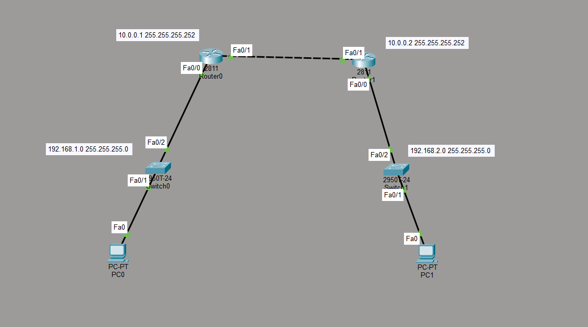

📌 Project Overview

This project demonstrates the configuration of a Site-to-Site IPsec VPN using ISAKMP (IKE) between two Cisco routers.
The objective is to securely connect two remote LAN networks over an untrusted network using encrypted IPsec tunnels.

The lab covers:

ISAKMP (IKE Phase 1)
IPsec (IKE Phase 2)
Pre-shared key authentication
Crypto ACL configuration
Crypto Map implementation
Secure tunnel verification

🌐 Network Topology
🖧 Site A
LAN Network: 192.168.1.0/24
Router0 LAN Interface: 192.168.1.1
WAN Interface: 10.0.0.1/30

🖧 Site B
LAN Network: 192.168.2.0/24
Router1 LAN Interface: 192.168.2.1
WAN Interface: 10.0.0.2/30

🌍 WAN Network
10.0.0.0/30

📷 Network Topology Screenshot

🔧 Configuration Steps
On Router1
crypto isakmp policy 10
 encryption aes
 hash sha
 authentication pre-share
 group 2
 lifetime 86400
exit

crypto isakmp key VPNKEY address 10.0.0.2

On Router2
crypto isakmp policy 10
 encryption aes
 hash sha
 authentication pre-share
 group 2
 lifetime 86400
exit

crypto isakmp key VPNKEY address 10.0.0.1

2️⃣ Configure IPsec Transform Set (Phase 2)
On Both Routers
crypto ipsec transform-set VPN-SET esp-aes esp-sha-hmac
 mode tunnel

 3️⃣ Configure Interesting Traffic (ACL)
On Router1
access-list 100 permit ip 192.168.1.0 0.0.0.255 192.168.2.0 0.0.0.255

On Router2
access-list 100 permit ip 192.168.2.0 0.0.0.255 192.168.1.0 0.0.0.255

4️⃣ Configure Crypto Map
On Router1
crypto map VPN-MAP 10 ipsec-isakmp
 set peer 10.0.0.2
 set transform-set VPN-SET
 match address 100
exit

On Router2
crypto map VPN-MAP 10 ipsec-isakmp
 set peer 10.0.0.1
 set transform-set VPN-SET
 match address 100
exit

5️⃣ Apply Crypto Map to WAN Interface
Router1
interface FastEthernet0/1
 crypto map VPN-MAP

Router2
interface FastEthernet0/1
 crypto map VPN-MAP

🧪 Verification Commands
show crypto isakmp sa
show crypto ipsec sa
show crypto session

🔐 Security Features Implemented

✔ AES Encryption
✔ SHA Hashing
✔ Pre-Shared Key Authentication
✔ Tunnel Mode IPsec
✔ Secure Site-to-Site Connectivity

👨‍💻 Author

Farid M
Cybersecurity Student
